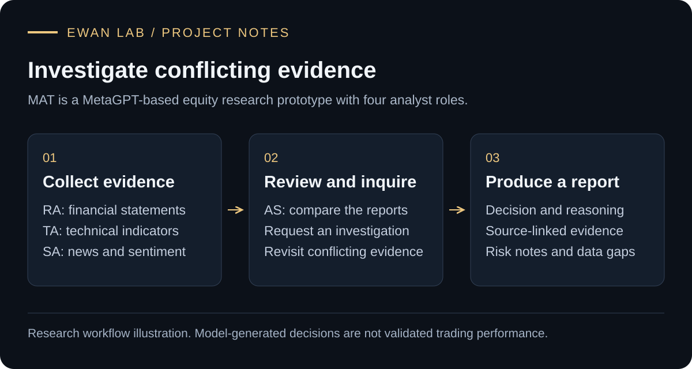
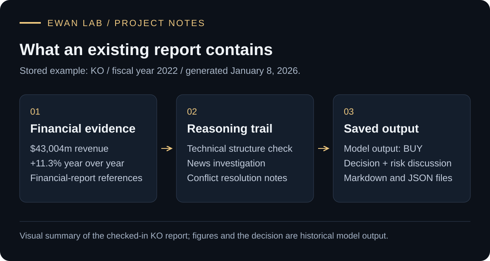

# MAT · Multi-Agent Equity Research

**A MetaGPT-based research prototype that investigates conflicting evidence before synthesizing a report.**

MAT combines financial-statement evidence, technical indicators, and news analysis. A coordinating analyst compares the reports and can request a targeted investigation before producing a source-linked decision and risk discussion.

[See a real stored report](#start-with-an-existing-report) · [How it works](#how-it-works) · [Code map](#read-the-code) · [Runtime requirements](docs/running.md) · [Provenance](NOTICE.md)

**Status:** research prototype. Existing reports are available without installing anything. The live runner requires external services and a compatible MetaGPT environment; a fresh, fully locked installation has not yet been validated.

## Start with an existing report

Input: **KO**, fiscal year **2022**. The stored example was generated on **January 8, 2026**.

Open the [KO strategy report](MAT/report/Strategy/Strategy_report_KO_2022.md) to inspect its reasoning and risk notes. For another example, compare the [AAPL Markdown report](MAT/report/Strategy/Strategy_report_AAPL_2022.md) and [structured JSON output](MAT/report/Strategy/Strategy_report_AAPL_2022.json).

These are historical model outputs. A generated `BUY` label or confidence score is not measured investment performance or a calibrated probability of success. The figure summarizes the saved report; it is not a live-product screenshot.

## How it works

The flowchart above follows the coordinator's decision path. The three analyst reports are inputs to AS; the additional SA investigation is conditional. AS remains responsible for synthesizing the final decision on either path.

| Role | Source and responsibility |
| --- | --- |
| **Research Analyst / RA** | Queries a user-configured RAGFlow collection for financial-report excerpts and structures the evidence. |
| **Technical Analyst / TA** | Retrieves price data through yfinance, calculates indicators, and produces an interpreted technical report. |
| **Sentiment Analyst / SA** | Collects news and sentiment evidence; responds to a targeted investigation request. |
| **Alpha Strategist / AS** | Buffers reports, calls conflict-analysis and synthesis Actions, and publishes the final report. |

The current coordinator requests **at most one additional investigation per ticker in its stored state**, then synthesizes with the available investigation report. Older design notes describe more general retry policies; those are not the current implementation.

## What this project demonstrates

- **Explicit report contracts:** Pydantic schemas connect roles through structured messages.
- **Evidence-aware synthesis:** financial metrics retain excerpts, source references, analysis, and data-gap fields.
- **Conditional coordination:** an investigation is requested when reports conflict, rather than being an unconditional extra agent step.
- **Inspectable outputs:** Markdown and JSON reports expose the decision, reasoning, and risks for review.

The project-specific MAT roles, schemas, Actions, orchestration, and report examples are maintained by **Ewan Su / Syx403** on top of MetaGPT. The repository also preserves introductory experiments under `Demo/` and custom tool examples under `Ewan_tools/`; these are separate from the MAT application.

## Read the code

| File | Responsibility |
| --- | --- |
| [MAT/main.py](MAT/main.py) | CLI orchestration, message tracing, and report persistence. |
| [MAT/schemas.py](MAT/schemas.py) | Evidence, analysis, investigation, and decision contracts. |
| [MAT/environment.py](MAT/environment.py) | Shared trading state and message propagation. |
| [MAT/roles/alpha_strategist.py](MAT/roles/alpha_strategist.py) | Conditional investigation and final synthesis orchestration. |
| [MAT/actions/synthesize_strategy.py](MAT/actions/synthesize_strategy.py) | Conflict-analysis and decision-synthesis Actions. |
| [MAT/actions/retrieve_rag_data.py](MAT/actions/retrieve_rag_data.py) | Financial-document retrieval and evidence shaping. |

## Running and verification

Start with the [runtime and dependency guide](docs/running.md). It distinguishes the no-install report tour from live API execution and documents the imported dependencies without inventing a tested version lock.

The repository includes historical verification scripts and recorded artifacts. Some older scripts still use pre-refactor numeric signal fields. Their presence does not establish that the current end-to-end system passes a fresh run. No trading-performance evaluation or production readiness is claimed.

Current code and this README take precedence over the clearly marked historical design notes in `MAT/readme/`. Remaining work includes dependency locking, updating legacy verification scripts, and a reproducible end-to-end acceptance run.

## Attribution and reuse

This repository builds on MetaGPT and external data/model services. See [NOTICE](NOTICE.md) for attribution and reuse boundaries. No project-wide open-source license has yet been selected.
